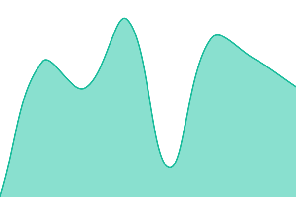

# [📈 Live Status](https://status.fr0st.xyz): <!--live status--> **🟩 All systems operational**

This repository contains the open-source uptime monitor and status page for [fr0st](https://fr0st.xyz), powered by [Upptime](https://github.com/upptime/upptime).

With [Upptime](https://upptime.js.org), you can get your own unlimited and free uptime monitor and status page, powered entirely by a GitHub repository. We use [Issues](https://github.com/fr0st-iwnl/status.fr0st.xyz/issues) as incident reports, [Actions](https://github.com/fr0st-iwnl/status.fr0st.xyz/actions) as uptime monitors, and [Pages](https://status.fr0st.xyz) for the status page.

<!--start: status pages-->
<!-- This summary is generated by Upptime (https://github.com/upptime/upptime) -->
<!-- Do not edit this manually, your changes will be overwritten -->
<!-- prettier-ignore -->
| URL | Status | History | Response Time | Uptime |
| --- | ------ | ------- | ------------- | ------ |
|  [fr0st.xyz](https://fr0st.xyz/) | 🟩 Up | [fr0st-xyz.yml](https://github.com/fr0st-xyz/status.fr0st.xyz/commits/HEAD/history/fr0st-xyz.yml) | 

 435ms
     
 | 

<a href="https://status.fr0st.xyz/history/fr0st-xyz">100.00%</a>
    

|  [search.fr0st.xyz](https://search.fr0st.xyz/) | 🟩 Up | [search-fr0st-xyz.yml](https://github.com/fr0st-xyz/status.fr0st.xyz/commits/HEAD/history/search-fr0st-xyz.yml) | 

 612ms
     
 | 

<a href="https://status.fr0st.xyz/history/search-fr0st-xyz">100.00%</a>
    

|  [data.fr0st.xyz](https://data.fr0st.xyz/) | 🟩 Up | [data-fr0st-xyz.yml](https://github.com/fr0st-xyz/status.fr0st.xyz/commits/HEAD/history/data-fr0st-xyz.yml) | 

 612ms
     
 | 

<a href="https://status.fr0st.xyz/history/data-fr0st-xyz">100.00%</a>
    

|  [notes.fr0st.xyz](https://notes.fr0st.xyz/) | 🟩 Up | [notes-fr0st-xyz.yml](https://github.com/fr0st-xyz/status.fr0st.xyz/commits/HEAD/history/notes-fr0st-xyz.yml) | 

 592ms
     
 | 

<a href="https://status.fr0st.xyz/history/notes-fr0st-xyz">100.00%</a>
    

|  [komga.fr0st.xyz](https://komga.fr0st.xyz/) | 🟩 Up | [komga-fr0st-xyz.yml](https://github.com/fr0st-xyz/status.fr0st.xyz/commits/HEAD/history/komga-fr0st-xyz.yml) | 

 565ms
     
 | 

<a href="https://status.fr0st.xyz/history/komga-fr0st-xyz">100.00%</a>
    

|  [voux.fr0st.xyz](https://voux.fr0st.xyz/) | 🟩 Up | [voux-fr0st-xyz.yml](https://github.com/fr0st-xyz/status.fr0st.xyz/commits/HEAD/history/voux-fr0st-xyz.yml) | 

 616ms
     
 | 

<a href="https://status.fr0st.xyz/history/voux-fr0st-xyz">100.00%</a>
    

|  [git.fr0st.xyz](https://git.fr0st.xyz/) | 🟩 Up | [git-fr0st-xyz.yml](https://github.com/fr0st-xyz/status.fr0st.xyz/commits/HEAD/history/git-fr0st-xyz.yml) | 

 589ms
     
 | 

<a href="https://status.fr0st.xyz/history/git-fr0st-xyz">100.00%</a>
    

|  [gist.fr0st.xyz](https://gist.fr0st.xyz/) | 🟩 Up | [gist-fr0st-xyz.yml](https://github.com/fr0st-xyz/status.fr0st.xyz/commits/HEAD/history/gist-fr0st-xyz.yml) | 

 1592ms
     
 | 

<a href="https://status.fr0st.xyz/history/gist-fr0st-xyz">100.00%</a>
    

|  [bookmarks.fr0st.xyz](https://bookmarks.fr0st.xyz/) | 🟩 Up | [bookmarks-fr0st-xyz.yml](https://github.com/fr0st-xyz/status.fr0st.xyz/commits/HEAD/history/bookmarks-fr0st-xyz.yml) | 

 1168ms
     
 | 

<a href="https://status.fr0st.xyz/history/bookmarks-fr0st-xyz">100.00%</a>
    

|  [sys.fr0st.xyz](https://sys.fr0st.xyz/) | 🟩 Up | [sys-fr0st-xyz.yml](https://github.com/fr0st-xyz/status.fr0st.xyz/commits/HEAD/history/sys-fr0st-xyz.yml) | 

 575ms
     
 | 

<a href="https://status.fr0st.xyz/history/sys-fr0st-xyz">100.00%</a>
    

<!--end: status pages-->

[**Visit our status website →**](https://status.fr0st.xyz)

## 📄 License

- Powered by: [Upptime](https://github.com/upptime/upptime)
- Code: [MIT](./LICENSE) © [fr0st](https://fr0st.xyz)
- Data in the `./history` directory: [Open Database License](https://opendatacommons.org/licenses/odbl/1-0/)
